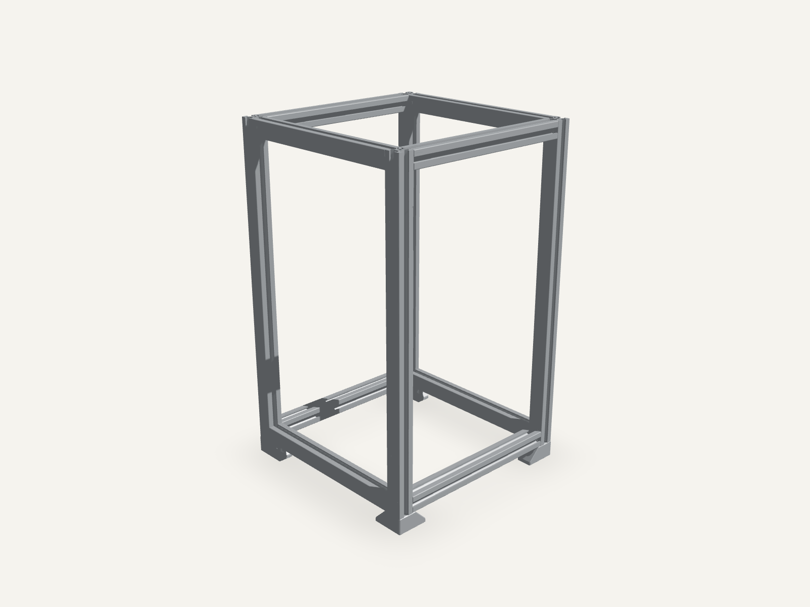
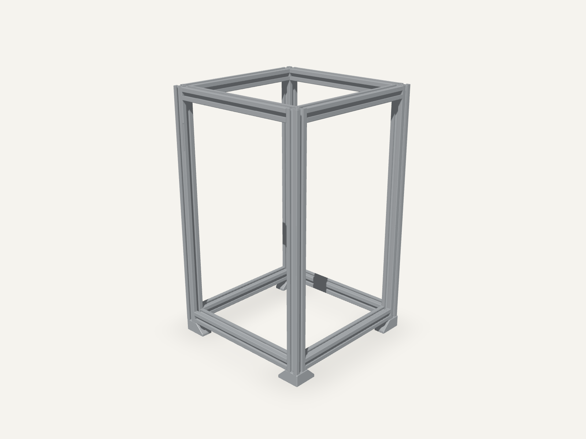

# MiniLab

MiniLab is a compact, modular server rack built around 2020 aluminium extrusion and standard rack-unit spacing. The hardware is the project: this repository contains the source STEP models for the frame, mounting plates, panels, shelves, and device-specific modules.

The rack currently targets an 8U build with a 258 × 258 mm footprint. Its module system is intentionally metadata-driven so future rack heights can reuse the same hardware library and mounting rules.

> **Companion tool:** [Open the MiniLab 3D configurator](https://minilab-configurator.pages.dev/) to assemble the current hardware modules in a browser before building the rack.

## Hardware renders

| Top-left | Top-right |
| --- | --- |
|  |  |

These images are rendered from the current STEP-derived frame model. Run `pnpm renders` after changing the CAD or mounting metadata to regenerate both views.

## Hardware specification

| Property | Current design |
| --- | --- |
| Rack height | 8U |
| Rack unit | 44.45 mm |
| Usable rack height | 355.6 mm |
| Frame footprint | Approximately 258 × 258 mm |
| Frame material | 2020 aluminium extrusion |
| Module sizes | 1U, 2U, and larger modules supported |
| CAD source format | STEP, exported from Fusion 360 |

Rack height is a design parameter rather than an application constant. The current frame is 8U, but the catalog and configurator can describe other heights.

## CAD source of truth

All original hardware sources live in [`models/`](models/). STEP files are never modified by the web-model pipeline.

The current hardware set includes:

- 8U 2020 extrusion frame and base plate
- Blank and test panels
- Patch panel and patch-panel plate
- Omada switch and HP Mini mounts
- Raspberry Pi and dual Raspberry Pi + OLED mounts
- Dot-matrix and TFT display panels
- Equipment tray

Files containing `LaserCut`, `laser cut`, or `laser-cut` identify parts intended for laser cutting. That manufacturing method is preserved in [`models/modules.json`](models/modules.json). No manufacturing method is assumed for the other parts.

The original STEP exports are committed so the hardware remains usable independently of the configurator. Generated GLB, OBJ, and MTL files are build artifacts and are not committed.

## Repository layout

```text
minilab/
├── models/                         Hardware source of truth
│   ├── *.step                      Original Fusion 360 STEP exports
│   └── modules.json                Rack dimensions and module metadata
├── configurator/                   Companion React/Three.js application
│   ├── public/models/catalog.json  Generated browser catalog
│   ├── src/                        Placement rules and 3D interface
│   └── docs/                       UI concepts and implementation records
├── scripts/
│   ├── models.mjs                  STEP-to-GLB pipeline orchestration
│   ├── render-models.mjs           Repeatable hardware render capture
│   └── freecad/step-to-obj.py      FreeCAD tessellation step
├── docs/images/                    Generated hardware renders used here
├── package.json
└── pnpm-workspace.yaml
```

## Add or revise hardware

1. Export the revised part from Fusion 360 as STEP.
2. Place the STEP file in `models/`. Keep `LaserCut` in the filename when applicable.
3. Add or update the exact filename in `models/modules.json`.
4. Set the hardware role and a verified integer `heightU`. Use `null` when the rack height still needs physical review.
5. Run `pnpm models` to regenerate the browser assets and catalog.
6. Inspect the part in several U positions using `pnpm dev`.
7. Run `pnpm test`, `pnpm lint`, and `pnpm build` before publishing changes.

The configurator never derives rack occupancy from tessellated geometry. `heightU` is explicit hardware metadata, while mounting transforms provide a non-destructive browser alignment layer for STEP exports with differing origins or axes.

## Module metadata

Each hardware part has an explicit catalog record:

```json
{
  "id": "1u-blank-lasercut",
  "name": "1U Blank",
  "source": "1U Blank LaserCut.step",
  "role": "module",
  "heightU": 1,
  "manufacturingMethod": "laser-cut",
  "model": "/models/1u-blank-lasercut.glb",
  "mount": {
    "position": [0, 0, 0],
    "rotation": [0, 0, 0],
    "scale": [1, 1, 1],
    "reference": "front-center-bottom"
  }
}
```

Important rules:

- `heightU` controls physical occupancy and overlap prevention.
- `heightU: null` marks hardware that still needs dimensional review and prevents placement.
- `role: "frame"` and `role: "fixed-part"` identify rack infrastructure.
- `role: "module"` makes a reviewed part available in the configurator library.
- `mount` corrects browser alignment without changing the original CAD.
- `preview` is only a procedural fallback and is not manufacturing data.

Nine current modules have reviewed 1U envelopes. Raspberry Pi Duo + OLED and Equipment Tray remain unplaceable until their rack heights are confirmed rather than guessed.

## Companion configurator

The browser configurator is a visualization and planning aid for the hardware. It renders the actual STEP-derived models, snaps modules to U positions, prevents collisions, supports different rack heights, and makes configurations easy to explore without acting like a full CAD package.

### Requirements

- Node.js 20 or newer
- pnpm 10 or newer
- A WebGL 2 capable browser
- Optional: [FreeCAD](https://www.freecad.org/downloads) with `FreeCADCmd` for regenerating real web models

Only pnpm is used for JavaScript dependencies and commands.

### Run locally

```bash
pnpm install
pnpm models
pnpm dev
```

### Project commands

| Command | Purpose |
| --- | --- |
| `pnpm models` | Scan hardware sources, convert changed STEP files, optimize GLBs, and regenerate the catalog |
| `pnpm renders` | Regenerate top-left and top-right hardware images from the real web model |
| `pnpm dev` | Start the local configurator |
| `pnpm test` | Run rack-placement, interaction, and model-pipeline tests |
| `pnpm lint` | Run ESLint with warnings treated as failures |
| `pnpm build` | Type-check and build the production configurator |
| `pnpm deploy` | Build and publish the companion configurator to Cloudflare Pages |

## STEP-to-web pipeline

Browsers cannot practically render STEP directly. `pnpm models` preserves the CAD sources and generates web assets through this pipeline:

```text
models/*.step
  → FreeCADCmd + scripts/freecad/step-to-obj.py
  → temporary tessellated OBJ
  → obj2gltf binary conversion
  → glTF Transform deduplication, welding, and pruning
  → configurator/public/models/*.glb
  → configurator/public/models/catalog.json
```

If FreeCAD is unavailable, the command still regenerates the catalog and the application uses procedural previews for missing GLBs. Require complete real-model conversion with:

```bash
MINILAB_MODELS_STRICT=1 pnpm models
```

For a non-standard FreeCAD installation:

```bash
FREECAD_CMD=/absolute/path/to/FreeCADCmd pnpm models
```

Generated `.glb`, `.obj`, and `.mtl` files are ignored by Git. The STEP files remain the canonical hardware assets.
